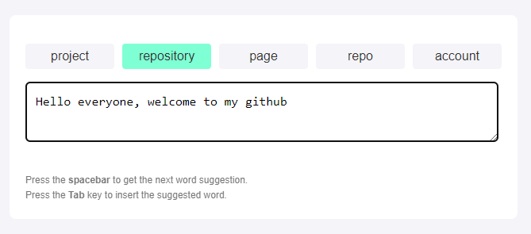

# Next Word Prediction

This is a FastAPI application that provides text prediction functionality using a pre-trained RoBERTa model. The application serves a static HTML file and exposes an endpoint for generating text predictions.



## Run the application


```bash
uvicorn main:app --reload
```

The application will be available at `http://127.0.0.1:8000`

## Contributing

Contributions are welcome! Please open an issue or submit a pull request for any improvements or bug fixes.

## Acknowledgments

- [Hugging Face](https://huggingface.co/) for providing the Transformers library.
- [FastAPI](https://fastapi.tiangolo.com/) for creating an easy-to-use web framework.